# Capital Flux — Detailed Design Document

> Digital wallet for personal finance tracking in volatile economies.
> **Version**: 1.0 | **Date**: February 18, 2026 | **Author**: Capital Flux Team

---

## Table of Contents

1. [Product Vision](#1-product-vision)
2. [Requirements](#2-requirements)
3. [Scrum Methodology](#3-scrum-methodology)
4. [UX/UI Design](#4-uxui-design)
5. [Glossary](#5-glossary)

---

## 1. Product Vision

### 1.1 Problem Statement

In Venezuela and other hyperinflationary economies, citizens face:

- **Multiple coexisting exchange rates** (official BCV, parallel, crypto P2P) with spreads of up to 70%
- **Rapid depreciation** of the local currency (534% over 12 months for VES)
- **Frequent power and internet outages** that prevent access to traditional banking apps
- **Periodic monetary reconversions** that change denomination scales
- **Need to operate in multiple currencies** simultaneously (VES, USD, EUR, COP)

### 1.2 Solution

**Capital Flux** is a personal finance-tracking digital wallet that:

- Operates **without an internet connection** and syncs automatically upon reconnection
- Supports **multiple currencies and real-time exchange rates**
- Provides **hyperinflation metrics** to support financial decision-making
- Ensures **security** through biometrics and local encryption
- **Adapts to any country** with stable or volatile economies

### 1.3 Target Users

| Persona | Description | Primary Need |
|---------|-------------|--------------|
| **María (28)** | Freelancer in Caracas, earns in USD, spends in VES | Track USD income and conversions to VES using parallel rate |
| **Carlos (35)** | Merchant handling cash in multiple currencies | Record transactions quickly, including without internet |
| **Ana (42)** | Teacher, salary in VES | Understand how much her salary loses to inflation each month |
| **Diego (30)** | Venezuelan in Colombia, sends remittances | Compare VES/COP/USD exchange rates |

---

## 2. Requirements

### 2.1 Functional Requirements

#### RF-01: Wallet Management

| ID | Requirement | Priority |
|----|--------------|----------|
| RF-01.1 | Create wallet with name, currency (VES/USD/EUR/COP), icon and color | High |
| RF-01.2 | Edit name, icon and color of existing wallet | Medium |
| RF-01.3 | Deactivate wallet (soft delete, do not remove data) | Medium |
| RF-01.4 | View current balance per wallet | High |
| RF-01.5 | View total consolidated balance in user's preferred currency | High |
| RF-01.6 | Manually reorder wallets (drag & drop) | Low |

#### RF-02: Transaction Management

| ID | Requirement | Priority |
|----|--------------|----------|
| RF-02.1 | Record income with amount, category, description and date | High |
| RF-02.2 | Record expense with amount, category, description and date | High |
| RF-02.3 | Record transfer between own wallets (with currency conversion) | High |
| RF-02.4 | Select exchange rate source when converting (BCV/Parallel/Binance) | High |
| RF-02.5 | Store snapshot of rate used for each transaction | High |
| RF-02.6 | Edit existing transaction | Medium |
| RF-02.7 | Delete transaction (soft delete) | Medium |
| RF-02.8 | Filter transactions by date, category, type, currency | Medium |
| RF-02.9 | Search transactions by description | Low |
| RF-02.10 | Register recurring transactions (monthly/biweekly/weekly) | Low |

#### RF-03: Exchange Rates

| ID | Requirement | Priority |
|----|--------------|----------|
| RF-03.1 | Display official BCV rate (USD/VES, EUR/VES) in real time | High |
| RF-03.2 | Display parallel rate (USD/VES) in real time | High |
| RF-03.3 | Display Binance P2P USDT/VES rate | Medium |
| RF-03.4 | Display international rates (USD/EUR, USD/COP, etc.) | Medium |
| RF-03.5 | Display daily/weekly/monthly percentage variation per rate | High |
| RF-03.6 | Historical rate chart (7d, 30d, 90d) | Medium |
| RF-03.7 | Quick converter between currencies with rate selector | High |
| RF-03.8 | Cache last known rate for offline use | High |
| RF-03.9 | Allow user to enter rate manually | Medium |

#### RF-04: Hyperinflation and Analysis

| ID | Requirement | Priority |
|----|--------------|----------|
| RF-04.1 | Display daily/weekly/monthly VES depreciation metric | High |
| RF-04.2 | Calculate purchasing power loss for VES balances | Medium |
| RF-04.3 | Display inflation-adjusted historical balance | Medium |
| RF-04.4 | Alert when daily depreciation exceeds configurable threshold | Low |
| RF-04.5 | Future value projection based on inflationary trend | Low |
| RF-04.6 | Expense report by category with temporal comparison | Medium |

#### RF-05: Offline Operation

| ID | Requirement | Priority |
|----|--------------|----------|
| RF-05.1 | All CRUD operations work without internet | High |
| RF-05.2 | Visual indicator for transactions pending sync | High |
| RF-05.3 | Automatic sync when connection is restored | High |
| RF-05.4 | Manual sync triggered by user | Medium |
| RF-05.5 | Conflict resolution with server-wins + merge strategy | High |
| RF-05.6 | Notify user if a conflict altered their data | Medium |
| RF-05.7 | Sync history (last sync, pending records) | Low |

#### RF-06: Authentication and Security

| ID | Requirement | Priority |
|----|--------------|----------|
| RF-06.1 | Sign up with email and password | High |
| RF-06.2 | Login with Google | High |
| RF-06.3 | Login with Apple | High |
| RF-06.4 | Login with Facebook | High |
| RF-06.5 | Unlock with biometrics (fingerprint / Face ID) | High |
| RF-06.6 | Backup PIN when biometrics unavailable | Medium |
| RF-06.7 | Auto-lock when app goes to background (configurable) | Medium |
| RF-06.8 | Persistent offline session (do not log out without internet) | High |
| RF-06.9 | Password recovery via email | Medium |

#### RF-07: Configuration

| ID | Requirement | Priority |
|----|--------------|----------|
| RF-07.1 | Select user base currency | High |
| RF-07.2 | Select preferred rate source (BCV/Parallel/Binance) | High |
| RF-07.3 | Change language (Spanish/English) | Medium |
| RF-07.4 | Enable/disable biometrics | Medium |
| RF-07.5 | Configure auto-lock duration | Low |
| RF-07.6 | Manage custom categories | Medium |
| RF-07.7 | Export transactions to CSV | Low |

---

### 2.2 Non-Functional Requirements

#### RNF-01: Performance

| ID | Requirement | Metric |
|----|--------------|--------|
| RNF-01.1 | App initial load time | < 2 seconds |
| RNF-01.2 | Offline transaction registration time | < 200ms |
| RNF-01.3 | Sync time (100 records) | < 5 seconds |
| RNF-01.4 | Transaction list rendering (1000+ items) | 60 FPS with virtualization |
| RNF-01.5 | Exchange rate update | < 3 seconds |

#### RNF-02: Availability and Reliability

| ID | Requirement |
|----|--------------|
| RNF-02.1 | App must operate 100% offline for CRUD operations |
| RNF-02.2 | Zero data loss during online/offline transitions |
| RNF-02.3 | Automatic retry with exponential backoff for failed syncs |
| RNF-02.4 | Local database must support up to 50,000 transactions |

#### RNF-03: Security

| ID | Requirement |
|----|--------------|
| RNF-03.1 | Sensitive data encrypted with AES-256 in local storage |
| RNF-03.2 | Authentication tokens stored in Keychain (iOS) / Keystore (Android) |
| RNF-03.3 | Communication exclusively over HTTPS |
| RNF-03.4 | RLS (Row Level Security) enabled on all Supabase tables |
| RNF-03.5 | No credentials stored in plain text |

#### RNF-04: Usability

| ID | Requirement |
|----|--------------|
| RNF-04.1 | Support for dark and light mode |
| RNF-04.2 | Interface in Spanish (default) and English |
| RNF-04.3 | Minimum accessibility WCAG 2.1 Level AA |
| RNF-04.4 | Support for screen sizes 4.7" to 6.9" |
| RNF-04.5 | Haptic feedback on financial actions |

#### RNF-05: Compatibility

| ID | Requirement |
|----|--------------|
| RNF-05.1 | iOS 15+ and Android 10+ (API 29+) |
| RNF-05.2 | Functional on low-end devices (2GB RAM) |
| RNF-05.3 | APK/IPA size < 50MB |

---

## 3. Scrum Methodology

### 3.1 Team Roles

| Role | Responsibility |
|------|----------------|
| **Product Owner** | Defines backlog priorities, accepts/rejects deliverables |
| **Scrum Master** | Facilitates ceremonies, removes impediments |
| **Dev Team** | Design, development, testing |

### 3.2 Ceremonies and Cadence

| Ceremony | Frequency | Duration | Purpose |
|----------|-----------|----------|---------|
| **Sprint Planning** | Start of sprint | 2h | Select backlog items, define Sprint Goal |
| **Daily Standup** | Daily | 15 min | Team sync: what I did, what I'll do, blockers |
| **Sprint Review** | End of sprint | 1h | Demo of deliverables to Product Owner |
| **Sprint Retrospective** | End of sprint | 1h | Continuous process improvement |
| **Backlog Refinement** | Mid-sprint | 1h | Detail and estimate future stories |

> [!NOTE]
> **Sprint duration**: 2 weeks (10 business days)

### 3.3 Definition of Done (DoD)

A backlog item is considered **Done** when:

- ✅ Code implemented and merged to `main`
- ✅ Unit tests written and passing (minimum 70% coverage)
- ✅ Type-checking passes with no errors (`tsc --noEmit`)
- ✅ Works offline and online
- ✅ UI responsive on target screens
- ✅ Code review approved by at least 1 member
- ✅ No regressions in existing features
- ✅ Documentation updated where applicable

### 3.4 Product Backlog — Epics and User Stories

---

#### Epic 1: Authentication and Onboarding

**Sprint Goal**: User can create an account, sign in, and protect the app with biometrics.

| ID | User Story | Points |
|----|------------|--------|
| US-01 | As a user, I want to **sign up with email and password** to create my account | 5 |
| US-02 | As a user, I want to **sign in with Google** for quick access | 3 |
| US-03 | As a user, I want to **sign in with Apple** for easy access on iPhone | 3 |
| US-04 | As a user, I want to **sign in with Facebook** to use my existing account | 3 |
| US-05 | As a user, I want to **configure biometrics** (fingerprint/Face ID) to unlock the app securely | 5 |
| US-06 | As a user, I want to **configure a backup PIN** in case biometrics fail | 3 |
| US-07 | As a user, I want **the app to lock automatically** when I leave to protect my data | 2 |
| US-08 | As a user, I want **my session to persist without internet** so I don't lose access during outages | 3 |

**Total**: 27 points → ~2 sprints

---

#### Epic 2: Multi-Currency Wallets

**Sprint Goal**: User can create wallets in VES, USD, EUR and COP and view their balances.

| ID | User Story | Points |
|----|------------|--------|
| US-09 | As a user, I want to **create a wallet** with name, currency, icon and color | 5 |
| US-10 | As a user, I want to **view the list of my wallets** with each balance | 3 |
| US-11 | As a user, I want to **view my total consolidated balance** in my preferred currency | 5 |
| US-12 | As a user, I want to **edit the name, icon and color** of a wallet | 2 |
| US-13 | As a user, I want to **deactivate a wallet** I no longer use without losing its history | 2 |

**Total**: 17 points → ~1 sprint

---

#### Epic 3: Transactions

**Sprint Goal**: User can record income, expenses and transfers with categories.

| ID | User Story | Points |
|----|------------|--------|
| US-14 | As a user, I want to **record income** with amount, category, description and date | 5 |
| US-15 | As a user, I want to **record an expense** with amount, category, description and date | 5 |
| US-16 | As a user, I want to **transfer between my wallets** converting between currencies | 8 |
| US-17 | As a user, I want to **choose the rate source** (BCV/Parallel/Binance) when converting | 5 |
| US-18 | As a user, I want to **view the transaction history** of a wallet | 3 |
| US-19 | As a user, I want to **filter transactions** by date, category and type | 5 |
| US-20 | As a user, I want to **edit a transaction** I recorded with incorrect data | 3 |
| US-21 | As a user, I want to **delete an erroneous transaction** | 2 |
| US-22 | As a user, I want **each transaction to store the exchange rate used** for future reference | 3 |

**Total**: 39 points → ~2-3 sprints

---

#### Epic 4: Exchange Rates

**Sprint Goal**: User can view real-time rates from multiple sources and convert currencies.

| ID | User Story | Points |
|----|------------|--------|
| US-23 | As a user, I want to **view the official BCV rate** updated | 5 |
| US-24 | As a user, I want to **view the parallel dollar rate** updated | 5 |
| US-25 | As a user, I want to **view the Binance P2P USDT/VES rate** | 3 |
| US-26 | As a user, I want to **view international rates** (USD/EUR, USD/COP) | 3 |
| US-27 | As a user, I want to **view daily/weekly/monthly percentage variation** | 5 |
| US-28 | As a user, I want **a quick converter** between currencies | 5 |
| US-29 | As a user, I want to **view a historical chart** of rates | 8 |
| US-30 | As a user, I want **rates to be cached** for use when I have no internet | 3 |
| US-31 | As a user, I want to **enter a manual rate** when no source is available | 3 |

**Total**: 40 points → ~2-3 sprints

---

#### Epic 5: Offline Mode and Sync

**Sprint Goal**: User can operate without internet and data syncs when reconnected.

| ID | User Story | Points |
|----|------------|--------|
| US-32 | As a user, I want to **create transactions without internet** and have them saved locally | 8 |
| US-33 | As a user, I want to **see an indicator** of how many operations are pending sync | 3 |
| US-34 | As a user, I want **sync to be automatic** when connection is restored | 8 |
| US-35 | As a user, I want to **trigger a manual sync** | 2 |
| US-36 | As a user, I want **conflicts to be resolved automatically** and to be notified if something changed | 8 |

**Total**: 29 points → ~2 sprints

---

#### Epic 6: Hyperinflation Analysis

| ID | User Story | Points |
|----|------------|--------|
| US-37 | As a user, I want to **see how much VES depreciated** today/this week/this month | 5 |
| US-38 | As a user, I want to **see how much purchasing power** my VES balance lost | 5 |
| US-39 | As a user, I want **an expense report by category** comparing periods | 8 |
| US-40 | As a user, I want to **receive an alert** when depreciation exceeds my threshold | 3 |

**Total**: 21 points → ~1-2 sprints

---

#### Epic 7: Configuration and Personalization

| ID | User Story | Points |
|----|------------|--------|
| US-41 | As a user, I want to **choose my base currency** | 2 |
| US-42 | As a user, I want to **choose my preferred rate source** | 2 |
| US-43 | As a user, I want to **change the app language** (ES/EN) | 3 |
| US-44 | As a user, I want to **create custom categories** with icon and color | 5 |
| US-45 | As a user, I want to **export my transactions to CSV** | 5 |

**Total**: 17 points → ~1 sprint

---

### 3.5 Sprint Planning

```mermaid
gantt
    title Capital Flux — Sprint Roadmap
    dateFormat  YYYY-MM-DD
    axisFormat  %d/%m
    
    section Sprint 1
    Project setup + Supabase           :s1a, 2026-02-24, 5d
    Auth Email + Google                 :s1b, after s1a, 5d

    section Sprint 2
    Auth Apple + Facebook + Biometrics   :s2a, after s1b, 5d
    Onboarding + Auto-lock              :s2b, after s2a, 5d

    section Sprint 3
    WatermelonDB + Local schema         :s3a, after s2b, 5d
    Wallets CRUD                        :s3b, after s3a, 5d

    section Sprint 4
    Transactions (income/expense)       :s4a, after s3b, 5d
    Categories + Filters                 :s4b, after s4a, 5d

    section Sprint 5
    Transfers + Conversion              :s5a, after s4b, 5d
    Exchange Rate Engine                :s5b, after s5a, 5d

    section Sprint 6
    Rates screen + Charts                :s6a, after s5b, 5d
    Quick converter                     :s6b, after s6a, 5d

    section Sprint 7
    Sync Engine + Offline Queue          :s7a, after s6b, 5d
    Conflict resolution                 :s7b, after s7a, 5d

    section Sprint 8
    Hyperinflation module                :s8a, after s7b, 5d
    Reports + Configuration             :s8b, after s8a, 5d
```



> [!IMPORTANT]
> **Estimated velocity**: ~15-20 points per sprint (2 weeks). Total: ~190 points → **8 sprints (16 weeks)**

---

## 4. UX/UI Design

### 4.1 Design Principles

| Principle | Application |
|-----------|-------------|
| **Offline-first visual feedback** | Always clear whether user is online/offline and what is pending |
| **Contextual currency** | Always display currency alongside amount, never the number alone |
| **Minimal friction** | Record a transaction in at most 3 taps |
| **Trust through transparency** | Display source and timestamp for each exchange rate |
| **Progressive disclosure** | Basic info visible; advanced details under expansion |

### 4.2 Navigation Map


### 4.3 Design System — Tokens

#### Color Palette

```
Dark Theme (Default)
──────────────────────────────
Background
  bg-primary:     #0F0F1A    (main background, near-black blue)
  bg-secondary:   #1A1A2E    (cards and surfaces)
  bg-tertiary:    #252540    (inputs and elevated elements)

Brand
  brand-primary:  #7C3AED    (primary violet)
  brand-secondary:#4F46E5    (indigo)
  brand-gradient: linear(135°, #4F46E5, #7C3AED)

Accent
  accent-green:   #10B981    (income, positive, online)
  accent-red:     #EF4444    (expense, negative, alerts)
  accent-amber:   #F59E0B    (warnings, pending sync)
  accent-blue:    #3B82F6    (informational, links)

Text
  text-primary:   #F8FAFC    (primary text, soft white)
  text-secondary: #94A3B8    (secondary text, gray)
  text-muted:     #475569    (disabled labels)

Surface
  border:         #334155    (subtle borders)
  divider:        #1E293B    (separators)
  overlay:        rgba(0,0,0,0.6) (modals)
```

#### Typography

```
Font Family: Inter (Google Fonts)
──────────────────────────────
Display:   32px / Bold    → Total balance
Heading 1: 24px / SemiBold → Section titles
Heading 2: 20px / SemiBold → Subtitles
Body:      16px / Regular  → General text
Body Sm:   14px / Regular  → Secondary text
Caption:   12px / Medium   → Labels, timestamps
Mono:      16px / JetBrains Mono → Financial amounts
```

#### Spacing and Borders

```
Spacing Scale: 4, 8, 12, 16, 20, 24, 32, 40, 48, 64
Border Radius: sm=8, md=12, lg=16, xl=24, full=9999
Shadows:
  sm: 0 1px 2px rgba(0,0,0,0.3)
  md: 0 4px 6px rgba(0,0,0,0.4)
  lg: 0 10px 15px rgba(0,0,0,0.5)
  glow: 0 0 20px rgba(124,58,237,0.3) (brand glow)
```

### 4.4 Wireframes — Main Flows

#### 4.4.1 Dashboard (Home)

```
┌──────────────────────────────────┐
│  ≡  Capital Flux        🔔  ●   │ ← ● = sync indicator
│─────────────────────────────────│
│                                  │
│  ┌─────────────────────────────┐ │
│  │ ░░░░░ GLASSMORPHISM ░░░░░  │ │
│  │                             │ │
│  │  Total Balance              │ │
│  │  $2,450.00 USD              │ │ ← Preferred currency
│  │  ≈ Bs. 968,950.00 (par.)   │ │ ← VES equivalent
│  │                             │ │
│  │  ▁▂▃▅▆▇█▇▆▅    +2.3% ↑    │ │ ← Mini sparkline 7d
│  │                             │ │
│  └─────────────────────────────┘ │
│                                  │
│  ┌──────┐ ┌──────┐ ┌──────┐    │
│  │  💵  │ │  📊  │ │  💱  │    │ ← Quick actions
│  │Income│ │Expense│ │Transf│    │
│  └──────┘ └──────┘ └──────┘    │
│                                  │
│  Exchange Rates                  │
│  ┌─────────────────────────────┐ │
│  │ BCV     │ Parallel │ Binance│ │
│  │ 395.87  │ 480.20   │ 476.50│ │ ← USD/VES rates
│  │ +0.8%   │ +1.2%    │ +0.9% │ │
│  └─────────────────────────────┘ │
│                                  │
│  Recent Transactions     View > │
│  ┌─────────────────────────────┐ │
│  │ 🛒 Supermarket    -$45.00  │ │
│  │    Today 2:30pm    Expense  │ │
│  ├─────────────────────────────┤ │
│  │ 💼 Freelance      +$500.00  │ │
│  │    Yesterday 10:00am  Income │ │
│  │    ⚡ Pending sync           │ │ ← Offline badge
│  ├─────────────────────────────┤ │
│  │ 💱 USD → VES     -$200.00  │ │
│  │    Feb 18          Transfer │ │
│  └─────────────────────────────┘ │
│                                  │
├──────────────────────────────────┤
│ 🏠    💳    ➕    📊    ⚙️    │ ← Tab bar
│ Home  Wall. New   Rates Config  │
└──────────────────────────────────┘
```

#### 4.4.2 New Transaction

```
┌──────────────────────────────────┐
│  ←  New Transaction             │
│─────────────────────────────────│
│                                  │
│  ┌────────┐┌────────┐┌────────┐ │
│  │ Income ││ Expense││Transf. │ │ ← Segmented control
│  │        ││▓▓▓▓▓▓▓▓││        │ │
│  └────────┘└────────┘└────────┘ │
│                                  │
│  Amount                           │
│  ┌─────────────────────────────┐ │
│  │        $ 45.00         USD ▼│ │ ← Amount + currency selector
│  └─────────────────────────────┘ │
│                                  │
│  ┌─────────────────────────────┐ │
│  │ ≈ Bs. 17,809.00   (parallel)│ │ ← Live conversion
│  │ ≈ Bs. 21,618.90   (BCV)    │ │
│  └─────────────────────────────┘ │
│                                  │
│  Wallet                           │
│  ┌─────────────────────────────┐ │
│  │ 💳 USD Account   $2,450 ▼  │ │
│  └─────────────────────────────┘ │
│                                  │
│  Category                         │
│  ┌──────┐┌──────┐┌──────┐┌────┐│
│  │  🍔  ││  🛒  ││  🚗  ││ +  ││ ← Category grid
│  │Food  ││Super ││Transp││More││
│  └──────┘└──────┘└──────┘└────┘│
│                                  │
│  Exchange Rate (if applicable)     │
│  ┌─────────────────────────────┐ │
│  │ ○ BCV (395.87)              │ │
│  │ ● Parallel (480.20)   ←sel │ │
│  │ ○ Binance P2P (476.50)     │ │
│  │ ○ Manual: [______]         │ │
│  └─────────────────────────────┘ │
│                                  │
│  Description (optional)            │
│  ┌─────────────────────────────┐ │
│  │ Weekly groceries...          │ │
│  └─────────────────────────────┘ │
│                                  │
│  Date         │   Feb 18, 2026  ▼│
│                                  │
│  ┌─────────────────────────────┐ │
│  │     ▓▓▓ SAVE EXPENSE ▓▓▓  │ │ ← Primary button
│  └─────────────────────────────┘ │
│                                  │
└──────────────────────────────────┘
```

#### 4.4.3 Exchange Rates Screen

```
┌──────────────────────────────────┐
│  ←  Exchange Rates       🔄      │ ← Pull to refresh
│─────────────────────────────────│
│                                  │
│  📶 Online · Updated 2:30pm     │
│                                  │
│  USD / VES                       │
│  ┌─────────────────────────────┐ │
│  │ BCV Official                 │ │
│  │ Bs. 395.87       +0.8% ↑   │ │
│  │ ▁▂▃▄▅▆▇█▇▅▃▂     7 days   │ │ ← Sparkline
│  ├─────────────────────────────┤ │
│  │ Parallel                     │ │
│  │ Bs. 480.20       +1.2% ↑   │ │
│  │ ▁▁▂▃▄▅▆▇█▇       7 days   │ │
│  ├─────────────────────────────┤ │
│  │ Binance P2P (USDT)          │ │
│  │ Bs. 476.50       +0.9% ↑   │ │
│  │ ▁▂▂▃▃▄▅▆▇▇       7 days   │ │
│  ├─────────────────────────────┤ │
│  │ ⚠️ BCV↔Parallel spread      │ │
│  │ 21.3%  (Bs. 84.33 diff.)    │ │ ← Spread indicator
│  └─────────────────────────────┘ │
│                                  │
│  EUR / VES                       │
│  ┌─────────────────────────────┐ │
│  │ BCV Official                 │ │
│  │ Bs. 425.60       +0.5% ↑   │ │
│  └─────────────────────────────┘ │
│                                  │
│  USD / COP                       │
│  ┌─────────────────────────────┐ │
│  │ Bs. 4,180.50     -0.3% ↓   │ │
│  └─────────────────────────────┘ │
│                                  │
│  ┌─────────────────────────────┐ │
│  │  💱  Open Converter         │ │
│  └─────────────────────────────┘ │
│                                  │
│  📊 VES Hyperinflation           │
│  ┌─────────────────────────────┐ │
│  │ Monthly depreciation: 38.2% │ │
│  │ Annualized: ~534%           │ │
│  │ Purchasing power: -28% 30d │ │
│  └─────────────────────────────┘ │
│                                  │
└──────────────────────────────────┘
```

#### 4.4.4 Offline State (Persistent Banner)

```
┌──────────────────────────────────┐
│ 📴 No connection · 3 pending    │ ← Amber/yellow banner
│──────────────────────────────────│
│  ...normal app content...        │
│                                  │
│  Transactions                    │
│  ┌─────────────────────────────┐ │
│  │ ⚡ 🛒 Supermarket  -$45.00   │ │ ← ⚡ = created offline
│  │    5 min ago       Expense   │ │
│  ├─────────────────────────────┤ │
│  │ ⚡ 💼 Payment received +$200 │ │
│  │    15 min ago     Income    │ │
│  └─────────────────────────────┘ │
│                                  │
│  Exchange rate:                   │
│  ┌─────────────────────────────┐ │
│  │ ⚠️ Last cached rate         │ │
│  │ Parallel: Bs. 480.20        │ │
│  │ Updated: 2 hours ago        │ │
│  │ Rates may have changed.     │ │
│  └─────────────────────────────┘ │
└──────────────────────────────────┘
```

### 4.5 User Flows

#### Flow 1: Record an expense (minimum 3 taps + keyboard)

```mermaid
graph LR
    A["Tab ➕"] --> B["Select 'Expense'"]
    B --> C["Enter amount"]
    C --> D["Select category"]
    D --> E["Tap 'Save'"]
    E --> F{"Online?"}
    F -->|Yes| G["✅ Saved and synced"]
    F -->|No| H["✅ Saved locally + badge ⚡"]
```



#### Flow 2: Reconnection after being offline

```mermaid
graph TD
    A["App detects connection"] --> B["Banner: '🔄 Syncing...'"]
    B --> C["Push pending operations"]
    C --> D{"Conflicts?"}
    D -->|No| E["Banner: '✅ 3 operations synced'"]
    D -->|Yes| F["Resolve conflicts automatically"]
    F --> G["Notification: '⚠️ 1 transaction was modified'"]
    G --> H["User can view conflict details"]
```



#### Flow 3: Currency conversion

```mermaid
graph TD
    A["Select 'Transfer'"] --> B["Choose source wallet USD"]
    B --> C["Choose destination wallet VES"]
    C --> D["Enter USD amount"]
    D --> E["App shows conversion at 3 rates"]
    E --> F["User selects rate: Parallel"]
    F --> G["Confirm: $200 → Bs. 96,040"]
    G --> H["✅ Both wallets updated"]
```



### 4.6 Key UI Components

| Component | Description | Variants |
|-----------|-------------|----------|
| **BalanceCard** | Glassmorphism card with balance and sparkline | Compact (home), Expanded (wallet detail) |
| **TransactionItem** | Transaction row with icon, amount, category | Normal, Offline (with ⚡), Syncing |
| **RateCard** | Rate card with value, variation and sparkline | BCV, Parallel, Binance, International |
| **SyncBanner** | Connection status banner | Online, Offline, Syncing, Error |
| **CurrencyInput** | Amount input with auto-format and currency selector | Simple, With dual conversion |
| **RateSelector** | Radio buttons to choose rate source | Vertical (form), Horizontal (compact) |
| **CategoryGrid** | Grid of selectable category icons | Horizontal scroll, Modal grid |
| **InflationWidget** | Inflation indicators with traffic-light colors | Dashboard mini, Rates expanded |
| **DualAmount** | Amount in two currencies simultaneously | Inline, Stacked |

### 4.7 Animations and Micro-interactions

| Element | Animation | Library |
|---------|-----------|---------|
| Balance on load | Numeric count-up from 0 | Reanimated 3 |
| Transaction saved | Micro confetti + scale bounce | Reanimated 3 |
| Tab change | Horizontal slide with fade | Expo Router built-in |
| Pull to refresh rates | Spinner with rotating currency icon | Reanimated 3 |
| Offline → Online | Banner slide-down with color transition | Reanimated 3 |
| Rate card expand | Expand/collapse with chart | Layout Animation |
| Save button | Haptic feedback + ripple | expo-haptics |
| Sync in progress | Circular loader with percentage | Reanimated 3 |
| Delete swipe | Swipe-to-delete with confirmation | Gesture Handler |

---

## 5. Glossary

| Term | Definition |
|------|------------|
| **BCV** | Central Bank of Venezuela — publishes the official exchange rate |
| **Parallel Dollar** | Unofficial exchange rate determined by the free market |
| **Binance P2P** | Peer-to-peer cryptocurrency market, used as reference for USDT/VES |
| **VES** | Digital Bolívar — official currency of Venezuela (ISO 4217) |
| **Reconversion** | Process by which Venezuela removes zeros from its currency (e.g. Bs.S → Bs.D) |
| **Offline-first** | Architecture where the app prioritizes local data and syncs when network is available |
| **RLS** | Row Level Security — Supabase policies that restrict access at row level |
| **WatermelonDB** | Reactive local database for React Native based on SQLite |
| **Soft delete** | Mark record as deleted without physically removing it (for sync) |
| **Sprint** | Fixed period of work (2 weeks) in Scrum methodology |
| **Story Point** | Relative unit of effort used to estimate task complexity |
| **COP** | Colombian Peso (ISO 4217) |
