# Capital Flux — Digital Wallet

Digital wallet designed for volatile economies such as Venezuela's, with multi-currency support, real-time exchange rates (official BCV, parallel, USDT P2P), hyperinflation handling, and **offline-first** capability that automatically syncs with the cloud when connectivity is restored.

> [!IMPORTANT]
> This is a complex project. The plan is divided into **incremental phases** to deliver progressive functionality.

---

## Tech Stack

| Layer | Technology | Rationale |
|-------|------------|-----------|
| **Framework** | React Native + Expo SDK 52+ | Unified build system, OTA updates with EAS |
| **Language** | TypeScript (strict mode) | Type safety critical for fintech |
| **Navigation** | Expo Router v4 | File-based routing, native deep linking |
| **Global State** | Zustand + TanStack Query | Zustand for UI state, TanStack for server state |
| **Local DB** | expo-sqlite | Lightweight local database, native to Expo, zero C++ configuration |
| **Backend** | Supabase (PostgreSQL + Auth + Realtime + Edge Functions) | Auth, RLS, Realtime subscriptions, serverless functions |
| **Sync** | Custom Sync (TanStack Query + expo-sqlite) | Bidirectional push/pull based on flags (pending_sync) and NetInfo |
| **Security** | expo-secure-store + expo-local-authentication | Keychain/Keystore + biometrics |
| **i18n** | expo-localization + i18next | Multi-language support (es, en) |
| **Exchange Rates** | BCV API + DolarApi.com + Binance P2P | Multiple sources for real-time rates |

---

## General Architecture

1. **Local-First with** `expo-sqlite`: All data is stored first on the device using SQLite. This ensures the app runs smoothly without internet.

2. **Sync Queue**: When a transaction is made without network, it is saved in SQLite with state `pending_sync = true`.

3. **Sync with Supabase**: When internet is detected, TanStack Query and the Custom Sync Engine take "pending" records and send them to PostgreSQL.

```mermaid
graph TB
    subgraph "📱 App (React Native)"
        UI["UI Layer<br/>Expo Router + Screens"]
        State["State Layer<br/>Zustand + TanStack Query"]
        Sync["Sync Engine<br/>WatermelonDB Sync"]
        LocalDB["Local DB<br/>WatermelonDB / SQLite"]
        Queue["Offline Queue<br/>Pending Operations"]
        Rates["Rate Engine<br/>Multi-source Exchange"]
    end

    subgraph "☁️ Backend (Supabase)"
        Auth["Supabase Auth<br/>Email + Google + Apple"]
        DB["PostgreSQL<br/>+ RLS Policies"]
        Edge["Edge Functions<br/>Rate Fetching + Sync RPC"]
        RT["Realtime<br/>Subscriptions"]
    end

    subgraph "🌐 External APIs"
        BCV["BCV API<br/>Official Rate"]
        Paralelo["DolarApi.com<br/>Parallel Rate"]
        Binance["Binance P2P<br/>USDT/VES"]
        Fiat["ExchangeRate API<br/>USD/EUR/COP etc."]
    end

    UI --> State
    State --> LocalDB
    State --> Sync
    Sync --> Queue
    Queue -->|"Online"| DB
    DB --> RT --> Sync
    LocalDB --> Sync
    
    Edge --> BCV
    Edge --> Paralelo
    Edge --> Binance
    Edge --> Fiat
    
    Rates --> Edge
    Rates --> LocalDB
    
    Auth --> UI
```



---

## Approved Decisions

- **Local Database**: `expo-sqlite`

- **Builds**: Development Builds (recommended for advanced native libraries if needed in the future) or Expo Go.

- **Auth**: Email + Google + Apple + Facebook via Supabase Auth.

- **Currencies**: VES, USD, EUR, COP.

- **Scope**: Personal finance tracking only (no P2P transfers).

---

## Project Structure

```
Capital_Flux/
├── app/                          # Expo Router (file-based routing)
│   ├── (auth)/                   # Authentication routes
│   ├── (tabs)/                   # Main navigation (Dashboard, Wallets, etc.)
│   ├── wallet/                   # Wallet detail views
│   ├── transaction/              # Transaction detail and creation views
│   ├── exchange/                 # Currency converter
│   ├── _layout.tsx               # Root layout
│   └── +not-found.tsx
├── src/
│   ├── components/               # Reusable UI components
│   ├── features/                 # Business logic modules
│   │   ├── auth/
│   │   ├── wallets/
│   │   ├── transactions/
│   │   ├── exchange-rates/
│   │   └── sync/                 # Custom Sync Engine
│   │       ├── engine.ts         # Sync orchestrator
│   │       ├── conflict-resolver.ts
│   │       └── types.ts
│   ├── db/                       # expo-sqlite configuration
│   │   ├── database.ts           # Initialization and table creation
│   │   └── queries.ts            # Local CRUD functions
│   ├── store/                    # Zustand stores
│   ├── lib/                      # Utilities (Supabase, currency, hyperinflation)
│   ├── hooks/                    # Global custom hooks
│   ├── constants/
│   └── types/                    # Global TypeScript types
├── supabase/                     # Supabase configuration and migrations
├── assets/                       # Images, fonts, icons
├── app.json
├── package.json
└── .env.example
```

---

## Database Schema

**Local Structure** (`expo-sqlite`)
This structure lives on the user's device to ensure offline persistence.

```sql
CREATE TABLE IF NOT EXISTS wallets (
    id TEXT PRIMARY KEY,
    server_id TEXT, -- Supabase ID once synced
    name TEXT NOT NULL,
    currency TEXT NOT NULL,
    balance REAL DEFAULT 0,
    icon TEXT,
    color TEXT,
    is_active BOOLEAN DEFAULT 1,
    pending_sync BOOLEAN DEFAULT 1,
    updated_at TEXT
);

CREATE TABLE IF NOT EXISTS transactions (
    id TEXT PRIMARY KEY,
    server_id TEXT, -- Supabase ID once synced
    wallet_id TEXT NOT NULL,
    category_id TEXT,
    type TEXT NOT NULL,
    amount REAL NOT NULL,
    currency TEXT NOT NULL,
    original_amount REAL,
    exchange_rate REAL,
    rate_source TEXT,
    date TEXT NOT NULL,
    pending_sync BOOLEAN DEFAULT 1,
    updated_at TEXT
);

CREATE TABLE IF NOT EXISTS exchange_rates (
    id TEXT PRIMARY KEY,
    base_currency TEXT NOT NULL,
    target_currency TEXT NOT NULL,
    rate REAL NOT NULL,
    source TEXT NOT NULL,
    fetched_at TEXT NOT NULL
);
```
**Backend** (`Supabase PostgreSQL`)

```sql
-- User profiles
CREATE TABLE profiles (
    id UUID PRIMARY KEY REFERENCES auth.users(id),
    display_name TEXT NOT NULL,
    default_currency TEXT NOT NULL DEFAULT 'USD',
    preferred_rate_source TEXT DEFAULT 'bcv',
    locale TEXT DEFAULT 'es',
    created_at TIMESTAMPTZ DEFAULT NOW(),
    updated_at TIMESTAMPTZ DEFAULT NOW()
);

-- Wallets (mirror of local but with DB UUIDs)
CREATE TABLE wallets (
    id UUID PRIMARY KEY DEFAULT gen_random_uuid(),
    user_id UUID NOT NULL REFERENCES profiles(id),
    client_id TEXT, -- Temporary ID generated locally by SQLite
    name TEXT NOT NULL,
    currency TEXT NOT NULL,
    balance DECIMAL(20, 4) DEFAULT 0,
    icon TEXT DEFAULT 'wallet',
    color TEXT DEFAULT '#4F46E5',
    is_active BOOLEAN DEFAULT true,
    created_at TIMESTAMPTZ DEFAULT NOW(),
    updated_at TIMESTAMPTZ DEFAULT NOW()
);

-- Transactions
CREATE TABLE transactions (
    id UUID PRIMARY KEY DEFAULT gen_random_uuid(),
    user_id UUID NOT NULL REFERENCES profiles(id),
    client_id TEXT, -- Temporary ID generated locally by SQLite
    wallet_id UUID NOT NULL REFERENCES wallets(id),
    category_id UUID,
    type TEXT NOT NULL CHECK (type IN ('income', 'expense', 'transfer')),
    amount DECIMAL(20, 4) NOT NULL,
    currency TEXT NOT NULL,
    original_amount DECIMAL(20, 4),
    exchange_rate DECIMAL(20, 8),
    rate_source TEXT,
    date TIMESTAMPTZ NOT NULL DEFAULT NOW(),
    created_at TIMESTAMPTZ DEFAULT NOW()
);

-- Exchange rates (remote history)
CREATE TABLE exchange_rates (
    id UUID PRIMARY KEY DEFAULT gen_random_uuid(),
    base_currency TEXT NOT NULL,
    target_currency TEXT NOT NULL,
    rate DECIMAL(20, 8) NOT NULL,
    source TEXT NOT NULL,
    fetched_at TIMESTAMPTZ NOT NULL DEFAULT NOW()
);

-- RLS Policies
ALTER TABLE profiles ENABLE ROW LEVEL SECURITY;
ALTER TABLE wallets ENABLE ROW LEVEL SECURITY;
ALTER TABLE transactions ENABLE ROW LEVEL SECURITY;
```
---

## Implementation Phases

**Phase 1 — Foundation (Week 1)**

- Create Expo project with TypeScript template (`npx create-expo-app`).
- Configure `tsconfig.json` with strict mode.
- Install core dependencies adapted for `expo-sqlite`.
- Configure Supabase Auth in the cloud and integrate it locally.

**Main dependencies:**
```json
{
  "dependencies": {
    "expo": "~52.0.0",
    "expo-router": "~4.0.0",
    "expo-sqlite": "~15.0.0",
    "expo-secure-store": "~14.0.0",
    "expo-local-authentication": "~15.0.0",
    "expo-localization": "~16.0.0",
    "@supabase/supabase-js": "^2.45.0",
    "zustand": "^5.0.0",
    "@tanstack/react-query": "^5.60.0",
    "@react-native-community/netinfo": "^11.0.0",
    "decimal.js": "^10.4.0",
    "date-fns": "^4.0.0",
    "react-native-reanimated": "~3.16.0"
  }
}
```

### Phase 2 — Core Offline-First (Week 2-3)

- `database.ts`: Initialize `expo-sqlite` creating tables with their corresponding columns and the `pending_sync` flag.

- `queries.ts`: Functions for CRUD in SQLite (e.g. `insertTransaction`, `getPendingWallets`).

- `engine.ts`: Sync engine that detects network with NetInfo. When connection is detected, it finds records with `pending_sync = true`, sends them to Supabase. If Supabase returns `200 OK`, it updates the local row setting `pending_sync = false` and stores the returned `server_id`.

---

### Phase 3 — Exchange Rate Engine (Week 3-4)

- **Adapters** (`bcv.ts`, `paralelo.ts`, `binance-p2p.ts`): Logic to connect to the corresponding rate APIs.

- `hyperinflation.ts`: Math utilities for percentage variations, depreciation and purchasing power loss.

- `currency.ts`: Integration of `decimal.js` for arbitrary-precision calculations, avoiding common floating-point issues when handling millions of bolívares.

---

### Phase 4 — UI/UX (Week 4-6)

#### Main Screens

| Screen | Description |
|--------|-------------|
| **Dashboard** | Multi-currency total balance, trend chart, latest transactions, rate alert |
| **Wallets** | Wallet list with balance, create/edit wallet |
| **Wallet Detail** | Filtered transactions, balance with historical chart |
| **New Transaction** | Form with real-time conversion, rate selector |
| **Exchange Rates** | View all rates, historical charts, BCV vs Parallel comparator |
| **Converter** | Quick converter between currencies with source selector |
| **Settings** | Profile, default currency, preferred rate source, biometrics, language |

#### Special Components for Venezuela

- **RateSelector**: Toggle between BCV/Parallel/Binance when creating a transaction
- **DualAmountDisplay**: Shows amount in VES + USD equivalent simultaneously
- **SyncStatusBar**: Mini visual indicator of sync status (green/yellow/red) notifies if there is data not yet uploaded to the cloud
- **OfflineBadge**: Visual badge on transactions created offline
- **CurrencyReconversion**: Handles denomination changes (e.g.: Bs.S → Bs.D)

#### Design System

- Dark mode as default (battery saving on OLED, common in Venezuela)
- Colors: purple/blue gradients (#4F46E5 → #7C3AED) with green accents (#10B981)
- Typography: Inter (Google Fonts)
- Animations with Reanimated 3 (tab transitions, pull-to-refresh)
- Glassmorphism on balance cards
- Haptic feedback on financial actions

---

### Phase 5 — Security (Week 5-6)

#### [NEW] [security.ts](file:///c:/Users/Yorber%20Rojas/Documents/Proyectos/Capital_Flux/src/lib/security.ts)
- `expo-secure-store` for tokens and encryption keys
- `expo-local-authentication` for biometrics (Face ID / fingerprint)
- Configurable backup PIN
- Auto-lock after X minutes in background
- Local backup encryption
- Never store financial data in plain text

#### Supabase Auth
- Email/password with verification
- Google Sign-In
- Apple Sign-In
- **Facebook Login**
- Refresh token persisted in secure store
- Offline session: token validated locally, refreshed when connected

---

### Phase 6 — Polish and Advanced Features (Week 6-8)

- **Customizable categories** with icons and colors
- **Reports**: Expenses by category, historical balance, accumulated inflation
- **Notifications**: Exchange rate alerts (e.g.: "Parallel rate went up 5% today")
- **Export**: CSV/PDF of transactions
- **Recurring transactions**: Recurring expenses (rent, utilities)
- **Multi-device sync**: Same account on multiple devices
- **Widgets**: Exchange rate widget for home screen (Expo Widgets)

---

## Offline Handling — Detailed Flow

With expo-sqlite, conflict handling is simplified with a clear directional flow:

1. **Local Creation**: The user saves an expense. It is inserted into `expo-sqlite` with a local UUID and `pending_sync = 1`.

2. **UI State**: The UI updates immediately by querying the local database (zero latency). A "cloud with clock" icon appears on the transaction.

3. **Network Detection**: `NetInfo` fires an event confirming internet is available.

4. **Push to Supabase**: TanStack Query or a background function reads all rows with `pending_sync = 1` and performs a batch insert into PostgreSQL.

5. **Local Update**: Supabase returns the created records with their definitive UUIDs. SQLite is updated: `pending_sync = 0` and `server_id` is stored. The icon disappears from the UI.

### Conflict Strategy

| Scenario | Resolution |
|----------|------------|
| Same record edited locally and remotely | Server wins, but merge non-modified fields on server |
| Record deleted on server, edited locally | Mark as conflict, ask user |
| Transaction created offline with balance | Recalculate balance post-sync |
| Outdated exchange rate in offline tx | Save rate used + "estimated" flag, alert post-sync |

---

## Verification (Testing Plan)

### Automated Tests

Tests will be created alongside each module. They will be run with:

```bash
# Unit tests with Jest
npx jest

# Tests for a specific module
npx jest --testPathPattern=src/features/exchange-rates

# Type checking
npx tsc --noEmit
```

**Key unit tests:**
- `currency.test.ts` — Arithmetic with `decimal.js`, formatting, conversions
- `hyperinflation.test.ts` — Inflation metric calculations
- `offline-queue.test.ts` — Enqueue/dequeue, retry, dedup
- `conflict-resolver.test.ts` — Conflict scenarios
- Rate source adapters — API mocks, correct parsing

### Manual Verification

> [!TIP]
> These tests require a real device or emulator with Expo Dev Build.

1. **Basic offline flow**:
   - Enable airplane mode on the device
   - Create 3 transactions
   - Verify they appear locally with the OfflineBadge
   - Disable airplane mode
   - Verify transactions sync (badge disappears)

2. **Exchange rates**:
   - Open the rates screen
   - Verify it shows BCV, Parallel, and Binance P2P
   - Compare values with manual sources (dolarvzla.com, al cambio)
   - Create a transaction selecting each rate source

3. **Security**:
   - Configure biometrics
   - Send app to background, return → should prompt for biometrics
   - Try login without connection → should work with cached session

4. **Hyperinflation**:
   - Verify dashboard shows inflation indicators
   - Verify formatting of large VES amounts (e.g. with reconversion)

> [!NOTE]
> As this is a new project with no existing tests, all tests will be created as part of the implementation.
